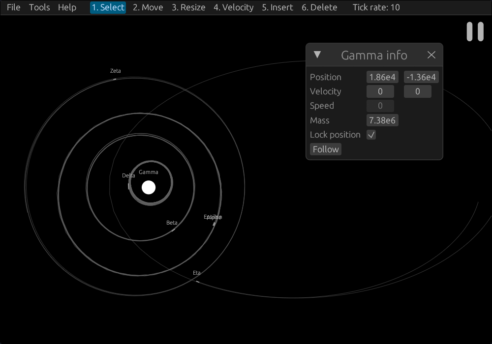

# Orbit Simulator

A multi-body Newtonian orbit simulator made in Rust with egui. [Click here](https://orbit.redpengu.in/) to access the web version!



## Features
- Newtonian gravity simulation with as many bodies as your computer can handle
- Collisions respect conservation of momentum
- Panning by dragging with left-click or middle-click and zooming by scrolling
- Tracking moving bodies with `RMB > Follow`
- Built-in visual aids for Kepler's Second Law and force/motion arrows
- Saving and loading of simulations to local files
- Easy access via [the web app](https://orbit.redpengu.in/)
- Tutorial guide to using the program on first open

## Compiling

The development environment can be opened with Nix:
```sh
nix develop
```
From there you can run a **native** version of the program with:
```sh
cargo run --release
```
...or locally host the **web** version of the program with:
```sh
trunk serve --release
```